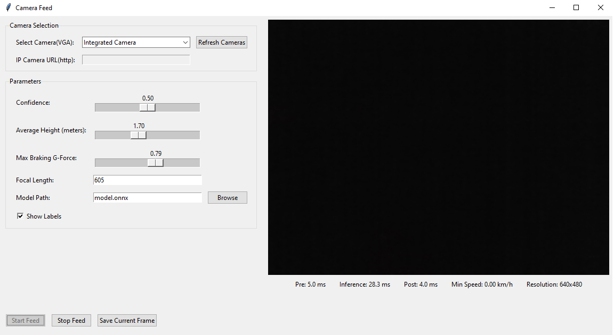
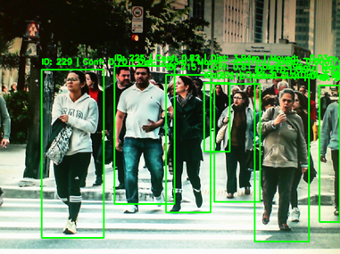
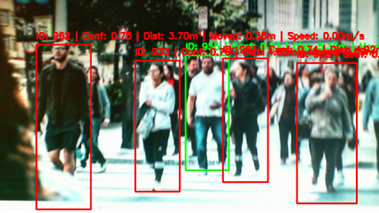

# Pedestrian-detection
This application runs a pedestrian detection model (based on a fine-tuned YOLO 11n) on your Windows device—supporting CPU, GPU, or integrated GPU (iGPU) via DirectML. It detects and tracks pedestrians (using the Supervision library) and estimates their distance from the camera based on the pinhole camera model. If a pedestrian is too close to stop safely—calculated using the maximum braking G-force—the bounding box around them turns red.

   

Also the model can run on mobile, the android implementation can be found [here](ONNXMobileRuntime)


## How to use

 - Create local venv:
  ```bash
  python -m venv venv
  ```
  ``` bash
  .\venv\Scripts\activate.bat
  ```
 - Install dependencies:
  ```bash
  pip install -r requirements.txt
  ```
 - Run it:
  ```bash
  python ApplicationGUI.py
  ```
  Or use the Run.bat

## About the Project

This project was developed as my bachelor’s thesis, motivated by the goal of providing an accessible tool to help drivers avoid accidents involving pedestrians.


## Citations
```bibtex
@software{yolo11_ultralytics,
  author = {Glenn Jocher and Jing Qiu},
  title = {Ultralytics YOLO11},
  version = {11.0.0},
  year = {2024},
  url = {https://github.com/ultralytics/ultralytics},
  orcid = {0000-0001-5950-6979, 0000-0002-7603-6750, 0000-0003-3783-7069},
  license = {AGPL-3.0}
}
@article{
  braun2019eurocity,
  author={Braun, Markus and Krebs, Sebastian and Flohr, Fabian B. and Gavrila, Dariu M.},
  journal={IEEE Transactions on Pattern Analysis and Machine Intelligence},
  title={EuroCity Persons: A Novel Benchmark for Person Detection in Traffic Scenes},
  year={2019},
  volume={},
  number={},
  pages={1-1},
  keywords={Proposals;Benchmark testing;Object detection;
          Feature extraction;Urban areas;Deep learning;
          Training;Object detection;benchmarking},
  doi={10.1109/TPAMI.2019.2897684},
  ISSN={0162-8828},
  month={}
}
```
